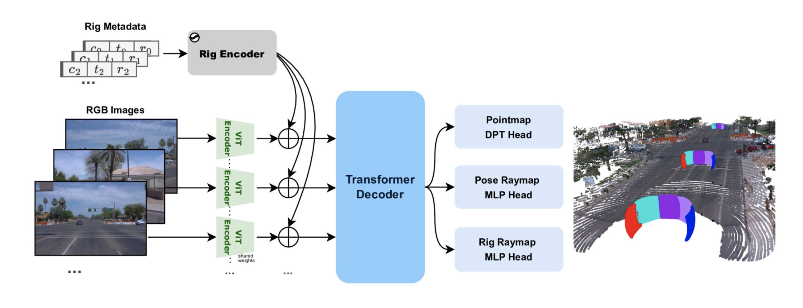

# 🛰️ Rig3R: Rig-Aware Conditioning for Learned 3D Reconstruction

**Rig3R** is a transformer-based model for multiview 3D reconstruction and camera pose estimation that incorporates **rig-aware conditioning**.
Unlike prior models (e.g., DUSt3R, Fast3R), Rig3R learns to leverage **rig metadata** (camera ID, timestamp, and rig pose) when available, and can **infer rig structure** when not — enabling robust 3D reconstruction across unstructured and rig-based image sets.

This repository is a **reimplementation** of the original [Rig3R paper (Li et al., 2025)](https://arxiv.org/abs/2506.02265), built for clarity, reproducibility, and extensibility.

---

## 🚀 Key Features

* **Rig-aware transformer architecture** using ViT-Large encoder-decoder.
* **Joint prediction** of:
  * Pointmaps (dense 3D coordinates),
  * Pose raymaps (global frame),
  * Rig raymaps (rig-relative frame).
* **Rig discovery**: infers rig calibration from unordered image collections.
* **Closed-form camera pose recovery** from raymaps. 
* **Multi-task learning** with dropout-based metadata conditioning.

---

## 🧠 Model Overview



---

## ⚙️ Dependencies

### Environment Set Up

Set up environment with [`uv`](https://docs.astral.sh/uv/)

```bash
make setup-env
```

### Activate the Environment

```bash
source .venv/bin/activate
```

### Install Dependencies

```bash
make install
```

---

## 🧩 Training

### Prepare Dataset

For complete setup instructions:

- Waymo: [Dataset Preparation – Waymo](docs/DATA_PREP.md#waymo)
- CO3D: [Dataset Preparation – CO3D](docs/DATA_PREP.md#co3d)


<!-- To work with a lightweight subset of the CO3D dataset (Common Objects in 3D), follow the steps below. These instructions are adapted from the [official CO3D GitHub repository](https://github.com/facebookresearch/co3d).

#### 1. Create the dataset directory

Create the directory in the current project folder

```bash
mkdir -p data/co3d
```

#### 2. Clone the CO3D repository

Clone the CO3D codebase **outside** of your current project folder:

```bash
git clone git@github.com:facebookresearch/co3d.git
cd co3d/
```

#### 3. Install dependencies

Install the required Python packages:

```bash
pip install visdom tqdm requests h5py
```

Then install the CO3D package itself:

```bash
pip install -e .
```

- **Note**: Make sure to install these packages in a separate environment

#### 4. Download the small subset of the dataset

Use the CO3D download script with the `--single_sequence_subset` flag to fetch a compact subset suitable for the many-view, single-sequence task:

```bash
python ./co3d/download_dataset.py \
  --download_folder DOWNLOAD_FOLDER \
  --single_sequence_subset
```

Example (downloading into this repo’s `data/co3d` folder):

```bash
python ./co3d/download_dataset.py \
  --download_folder ../Open-Rig3R/data/co3d/ \
  --single_sequence_subset
```

This subset requires ~8.9 GB, significantly smaller than the full dataset (~5.5 TB). -->

### Download the Pretrained DUSt3R Model

```bash
make setup-train
```

### Start Training

```bash
make train
```

- **Note**: for debugging or training on a less powerful machine, you can run the command below

```bash
make train-debug
```

Recommended configuration values:

* Batch size: 128
* Frames per sample: 24
* Image size: 512×512
* Optimizer: AdamW (lr=1e-4)
* Scheduler: Cosine annealing
* Dropout on metadata: 0.5

- **Note**: Check out here for [more training details](docs/TRAINING_DETAILS.md)

---

## 🧪 Evaluation

**Note**: Make sure to have trained models ready

### Prepare Wayve Scene 101 datasets

```bash
make download-wayve101
```

### Evaluate a pretrained Rig3R model:

```bash
make evaluate
```

- **Note**: for debugging or evaluating on a less powerful machine, you can run the command below

```bash
make evaluate-debug
```

Metrics:

* **RRA / RTA @5°/15°/30°**
* **mAA (mean angular accuracy)**
* **Chamfer distance**
* **Rig discovery accuracy (Hungarian assignment)**

---

## 🔍 Rig Discovery

Run unsupervised rig calibration discovery:

```bash
python scripts/infer_rig_discovery.py --config configs/evaluate.yaml
```

- **Note**: for debugging or running it on a less powerful machine, you can run the command below

```bash
python scripts/infer_rig_discovery.py --config configs/evaluate_mini.yaml
```

### Outputs

The script calculates and reports:
* **Rig ID Accuracy**: How well frames are clustered into cameras.
* **Rig mAA**: Mean Angular Accuracy of the recovered rig extrinsics.
* **Chamfer Distance**: Quality of the reconstructed 3D pointcloud.

It also produces:
* Clustered rig raymaps (internal representation)
* Reconstructed 3D pointclouds
* Estimated rig configurations (extrinsics)

---

## 🧰 Citation

If you use this reimplementation, please cite the original paper:

```bibtex
@article{li2025rig3r,
  title={Rig3R: Rig-Aware Conditioning for Learned 3D Reconstruction},
  author={Li, Samuel and Kachana, Pujith and Chidananda, Prajwal and Nair, Saurabh and Furukawa, Yasutaka and Brown, Matthew},
  journal={arXiv preprint arXiv:2506.02265},
  year={2025}
}
```
